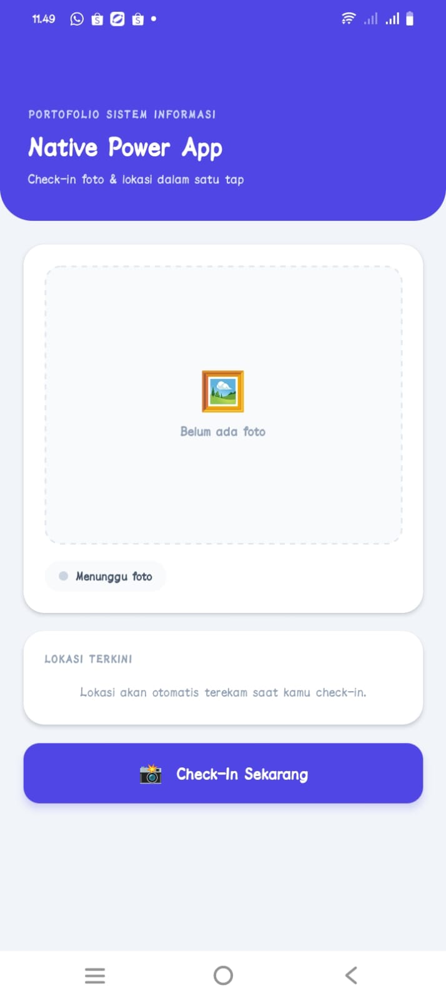
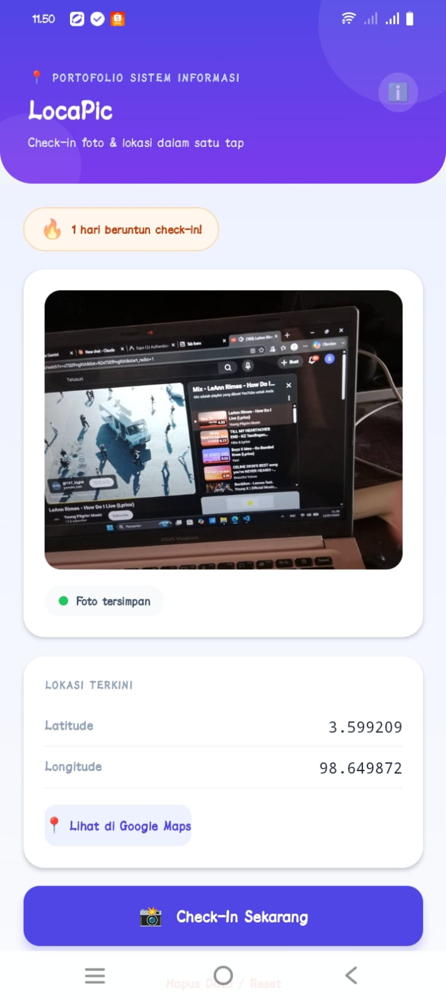
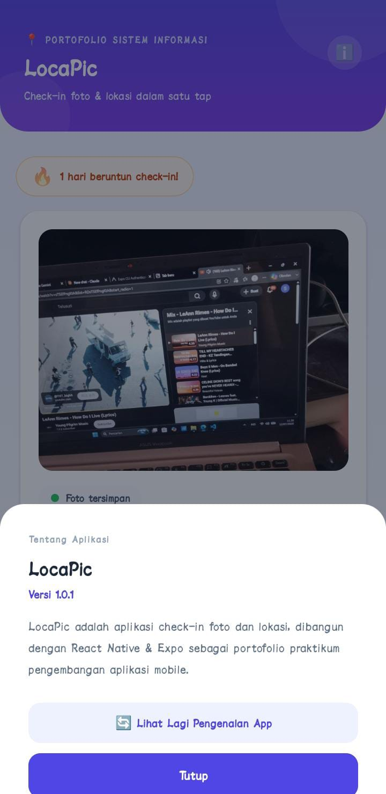
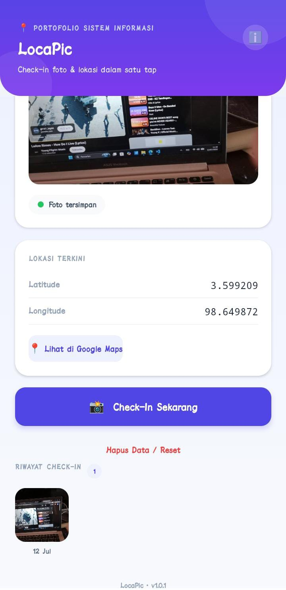

# 📸 LocaPic — Check-In Foto & Lokasi

Aplikasi mobile check-in foto + lokasi, dibangun dengan **React Native (Expo)**.
Dibuat sebagai proyek portofolio untuk mata kuliah *Software Testing and Implementation* — Universitas Prima Indonesia.

Sekali tap, aplikasi ini mengambil foto (kamera/galeri) dan otomatis mengunci koordinat GPS kamu, lalu menyimpannya secara persisten di HP — bahkan setelah aplikasi ditutup.

---

## 📱 Screenshot

| Tampilan Awal | Setelah Ambil Foto | Info APK | | Detail Lokasi |
|---|---|---|---|
|  |  |  |  |

> Screenshot APK terinstall di HP fisik ada di folder [`screenshots/`](./assets/APK.jpeg).


## ✨ Fitur Utama

- 🎬 **Layar perkenalan (onboarding)** 3-slide dengan gradient & animasi saat pertama kali dibuka
- 📸 **Ambil foto** langsung dari kamera atau pilih dari galeri
- 📍 **Auto-capture lokasi GPS** setiap kali check-in foto
- 🗺️ **Buka lokasi di Google Maps** dengan satu tap
- 💾 **Data persisten** — foto & lokasi tersimpan lewat `AsyncStorage`, tetap ada walau app ditutup
- 🔐 **Permission flow lengkap** — meminta izin kamera, galeri, dan lokasi, dengan fallback membuka Settings HP jika ditolak
- ℹ️ **Info versi aplikasi** — ditampilkan di footer & halaman About (via `expo-constants`)
- 🔄 **Reset data** kapan saja dari dalam aplikasi

---

## 🛠️ Tech Stack

| Kategori | Teknologi |
|---|---|
| Framework | React Native + Expo (SDK 54) |
| Kamera & Galeri | `expo-image-picker` |
| Lokasi | `expo-location` |
| Penyimpanan lokal | `@react-native-async-storage/async-storage` |
| Info versi app | `expo-constants` |
| Build APK | EAS Build (`eas-cli`) |

---

## 📥 Cara Install APK

1. Download APK dari EAS dashboard: **[Link APK di sini]**
2. Transfer/download file `.apk` ke HP Android kamu
3. Buka file APK-nya — jika muncul peringatan "Install dari sumber tidak dikenal", aktifkan izin tersebut di pengaturan
4. Tap **Install**, tunggu selesai
5. Buka aplikasinya dari app drawer — nama app-nya **LocaPic**

> ⚠️ APK ini untuk keperluan demo/portofolio, belum dipublikasikan ke Google Play Store.

---

## 💻 Menjalankan dari Source Code

```bash
git clone https://github.com/<username-kamu>/locapic.git
cd locapic
npm install
npx expo start
```

Scan QR code yang muncul dengan aplikasi **Expo Go** di HP kamu.

---

## 🚀 Build APK Sendiri (EAS Build)

```bash
npm install -g eas-cli
eas login
eas init
eas build --platform android --profile preview
```

Setelah build selesai (status `FINISHED`), link download APK akan muncul di terminal dan di [EAS dashboard](https://expo.dev).

---

## 📂 Struktur Proyek

```
locapic/
├── App.js              # Komponen utama aplikasi
├── app.json             # Konfigurasi Expo (icon, splash, permissions, dll)
├── eas.json              # Konfigurasi EAS Build (profile preview → APK)
├── index.js
├── package.json
├── assets/                # Icon, splash, dan asset gambar
└── screenshots/           # Bukti build & instalasi APK
```

---

## 🔁 Riwayat Rilis (Bonus C — Siklus Rilis Nyata)

Proyek ini sudah melalui 2 kali EAS Build, mensimulasikan siklus rilis aplikasi sungguhan.

### 📦 Build #1 — v1.0.0 (`versionCode: 1`)
Rilis awal. Fitur inti:
- Ambil foto (kamera/galeri) + auto-capture GPS
- Simpan 1 data terakhir via `AsyncStorage`
- Tombol buka lokasi di Google Maps
- Tombol reset data

### 📦 Build #2 — v1.0.1 (`versionCode: 2`) — **rilis saat ini**
Perubahan UI & fitur dari v1.0.0:

| Area | v1.0.0 | v1.0.1 |
|---|---|---|
| Nama app | Native Power App | **LocaPic** (rebrand penuh + icon baru) |
| First impression | Langsung ke layar utama | **Onboarding 3-slide** dengan gradient & animasi saat pertama buka app |
| Tampilan | Background & header flat/polos | **Gradient indigo-ungu** di header + background lembut, aksen dekoratif |
| Riwayat data | Hanya menyimpan 1 foto+lokasi terakhir | Menyimpan **riwayat hingga 30 check-in** dalam timeline horizontal yang bisa di-scroll |
| Gamifikasi | Tidak ada | **Badge streak 🔥** dengan animasi pulsa, menghitung hari beruntun check-in |
| Feedback aksi | Tidak ada feedback khusus | **Animasi perayaan** (🎉) muncul setiap check-in berhasil |
| Detail data | Lokasi ditampilkan di kartu utama saja | Tap kartu riwayat → **modal detail** (foto besar, tanggal lengkap, koordinat, link Maps) |
| Info versi | — | Ditambahkan (Bonus A), tampil di footer & modal About |

**Cara reproduksi build kedua:**
```bash
# 1. Pastikan app.json sudah di-bump
#    "version": "1.0.1"
#    android.versionCode: 2

# 2. Build ulang dengan profile yang sama
eas build --platform android --profile preview

# 3. Setelah FINISHED, download APK baru dan install di HP
#    (APK lama otomatis bisa di-overwrite karena versionCode lebih tinggi)
```

## ℹ️ App Version Display (Bonus A)

Versi aplikasi dibaca langsung dari `app.json` memakai `expo-constants`, jadi tidak perlu hardcode manual — otomatis sinkron setiap kali versi di-bump.

```js
import Constants from 'expo-constants';

const APP_VERSION = Constants.expoConfig?.version ?? '1.0.0';
```

Ditampilkan di dua tempat:
- **Footer** di bagian bawah halaman utama (`LocaPic · v1.0.1`)
- **Modal "Tentang Aplikasi"** — dibuka lewat tombol ℹ️ di pojok kanan header

---

## 🔖 Versi

**v1.0.1** (`versionCode: 2`) — Update: riwayat check-in, streak, animasi perayaan
**v1.0.0** (`versionCode: 1`) — Rilis awal

Dibuat oleh Stephani — Universitas Prima Indonesia.

"# LocaPic-APP" 
